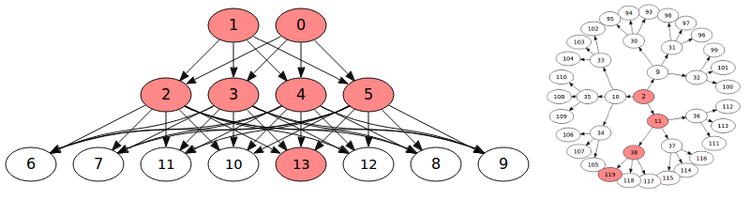
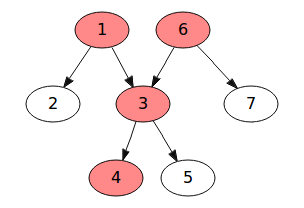
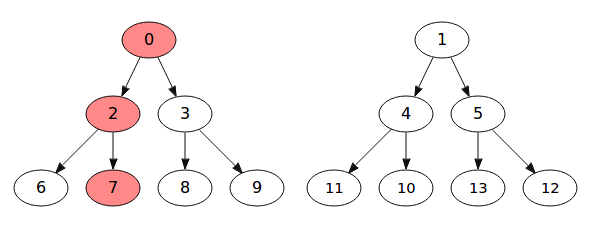

.. dagger documentation master file, created by
   sphinx-quickstart on Sun Nov 25 18:08:55 2012.
   You can adapt this file completely to your liking, but it should at least
   contain the root `toctree` directive.

Dagger - The File Dependency Graph Engine
=========================================

    
.. contents:: Table of Contents
    :depth: 2

    
Overview
--------
`Dagger <http://sourceforge.net/projects/pythondagger>`_ evaluates file dependencies in a directed-acyclic-graph (DAG) 
like GNU make, but timestamps or hashes can be enabled per file. 
This allows you to use fast timestamp comparisons with large files, 
and hashing on small files. When hashing is used, it's stored in a 
simple 2 column text file with filename,hash per line or in a sqlite 
database. Dagger can be used as a building block for a larger build 
system that is serial or parallel.

Dagger is written in Python to make it portable and extensible. It's 
graph evaluation engine is non-recursive, so it can handle very deep
dependency paths. A benchmark tool (see below) is available to test and visualize complex graphs, and demonstrates using 1 million files.

Features
--------
* Dependency based on modified time or hash (md5) for individual or all files.
* Force individual files as stale or uptodate.
* Missing files are automatically stale, unless set as phony. 
* All-paths computation for every node and discovery order.
* Written in pure Python to be platform agnostic.
* Non-recursive graph algorithm.
* Hash database in text or sqlite (and in-memory during runtime).
* Graphviz dot file export that colors stale file nodes.
* Iterate over results grouped by job queue size to allow parallel processing of mutually independent nodes. 

Quick Example
-------------
Let's create a small graph that looks like this:
  

    
    **example.dot** visualized with kgraphviewer. Stale nodes are red.
    
::
  
    >>> # Create some empty test files.
    >>> import os
    >>> os.system('touch 1 2 3 4 5 6 7')

    >>> import dagger
    >>> dag = dagger.dagger()
    
    >>> # Add nodes and others they depend on.
    >>> dag.add('1', ['2','3'])
    >>> dag.add('3', ['4','5'])
    >>> dag.add('6', ['3','7'])

    >>> # Force this node to be old, and all its dependent parents.
    >>> dag.stale('4')

    >>> # Evaluate the graph.
    >>> dag.run()

    >>> # Export for visualizing.
    >>> dag.dot('example.dot')

    >>> # Get iterator.
    >>> it = dag.iter()
    
    >>> # See how many items there are in total.
    >>> print len(it)
    4

    >>> # Get next 2 files we can process in parallel.
    >>> todo = it.next(2)
    >>> print todo 
    ['4']
    >>> # Only one is returned because other nodes depend on it.

    >>> # Pretend we finished first task, so remove it and get next 2.
    >>> it.remove('4')
    >>> todo = it.next(2) 
    >>> print todo 
    ['3'] 
    >>> # We still get single item because 6 & 1 depend on 3.    
    
    >>> it.remove('3')
    >>> todo = it.next(2)
    >>> print todo 
    ['1','6'] 
    >>> # We finally get two independent items.
    
Download
--------
`Source code <http://sourceforge.net/projects/pythondagger/files/>`_

`PYPI <http://pypi.python.org/pypi/dagger>`_ has a Windows installer.

Installation
------------
.. code-block:: bash

    # On a system with PIP installed.
    $ pip install -U dagger
    
    # If PIP is not available, you can use a source distribution.
    $ tar zxvf *dagger*.tgz
    $ cd *dagger*
    $ sudo python setup.py install
    
    # For Windows, download and run the binary installer from PYPI.

Testing
-------
.. code-block:: bash
  
    # Run the unit tests.
    $ make test

Benchmarking
------------
There is a script in ``bench/`` to help you see how fast dagger can evaluate the dependency graph.
You can specify how many children there are per node and depth of the mock graph.

.. code-block:: bash
  
    $ cd bench
    $ python bench.py --levels 3 --width 2 --dot 3x2.dot
    nodes: inner=6 outer=8 total=14
    0.0s Run   
    

    
    3 level, 2 child wide graph output by bench.py with 1 old node ('7').

These are larger test cases that simulate 56,000 and 1 million files.

.. code-block:: bash

    $ python bench.py --levels 6 --width 6 --allpaths
    nodes: inner=9330 outer=46656 total=55986
    0.24s Run   
    
    # See if even faster with pypy.
    $ pypy bench.py --levels 6 --width 6 --allpaths
    nodes: inner=9330 outer=46656 total=55986
    0.16s Run   

    # Try extreme case of simulating 1 million files.
    $ python bench.py --levels 7 --width 7 --allpaths
    nodes: inner=137256 outer=823543 total=960799
    6.35s Run   
    
    # pypy reports a shorter runtime for the 1 million node graph.
    $ pypy ...
    3.17s Run

Examples
========

Hashing with Plain Text Database
--------------------------------------
::
  
    >>> # It's ok if database doesn't exist yet. 
    >>> dag = dagger.dagger('/home/project/hash.txt')
    
    >>> dag.add(...)
    
    >>> # Enable hashing for all files.
    >>> dag.hashall = 1
    
    >>> # Evaluates the dependencies and computes hashes if none existed.
    >>> dag.run()
    
    >>> # Export the file.
    >>> dag.exporthash()

Hashing with Sqlite
-------------------
::
  
    >>> # This time use sqlite (in-memory) database instead of text file.
    >>> # Ok if doesn't exist yet. It will be created.
    >>> dag = dagger.dagger('hash.sqlite', sqlite=True, sqlite_memory=True)
    
    >>> dag.add(...)
    
    >>> # Export the file.
    >>> dag.exporthash()

Hashing Specific Files
--------------------------
::

    >>> # Enable hashing for file.
    >>> dag.hash('myfile', True)
    
    >>> # Turn it off (hashing is off by default for all nodes).
    >>> dag.hash('myfile', False) 

Phony Nodes
-----------
    >>> # In a graph: 1 -> 2 -> 3
    >>> # 1 and 2 would be stale if 2 was missing, by default.
    >>> os.system('touch 1 3')
    >>> dag.add('1', ['2'])
    >>> dag.add('2', ['3'])
    >>> dag.run()
    >>> dag.get('2').stale
    True
    >>> dag.get('1').stale
    True
    
    >>> # However, you can make 2 phony, so 1 is stale if 3 was,
    >>> # or 1 is itself stale due to an old hash or it's missing.
    >>> dag.phony('2')
    >>> dag.run()
    >>> dag.get('2').stale
    False
    >>> dag.get('1').stale
    False

Additional Graph Results
------------------------
::

    >>> dag.add(...)
    >>> dag.run()
    
    >>> # See the depth-first-search node order.
    >>> print dag.ordernames() 
    2,4,5,3,1,7,6
    
    >>> # Access the search ordered nodes directly.
    >>> print dag.order.list
    [<dagger.node object at ...>, <dagger.node object at ...>, ...]
 
    >>> # Get paths for a node; root nodes are rightmost in sublists.
    >>> print dag.pathnames('4')
    [['3', '1'], ['3', '6']]

News
====
**v1.3.0** 2012/11/25

* Added phony node support.
* Migrated documentation to Sphinx.

**v1.2.2** 2012/11/22

* Fixed iterator creation for root nodes.

**v1.2.1** 2012/11/21

* Missing files are automatically considered stale.

**v1.2.0** 2012/11/21

* Made private container "idict" iterable.

**v1.1.0** 2012/11/19

* Added `__len__` function to iterator to see how many tasks remain.

**v1.0.0** 2012/11/14

* Iterator added to access independent sets of nodes, thus allowing parallel processing in context of "make" processflows.

**v0.0.0** 2012/10/15

* Initial release.

.. toctree::
   :maxdepth: 2

Administration
==============

Distribution
------------
.. code-block:: bash

    make clean
    make html
    make dist VER=1.3.0
    make pypidocs
    make pypi

Publishing
----------
.. code-block:: bash

    ssh -t rsz,pythondagger@shell.sourceforge.net create
    
    scp -r doc/_build/html/* \
    rsz,pythondagger@shell.sourceforge.net:/home/project-web/pythondagger/htdocs

    scp ../pythondagger-1.3.0.tar.gz \
    rsz,pythondagger@shell.sourceforge.net:/home/frs/project/p/py/pythondagger

License
=======
Copyright 2012 Remik Ziemlinski -- GNU General Public License

API
===
:mod:`dagger` module.

Indices and tables
==================

* :ref:`genindex`
* :ref:`modindex`
* :ref:`search`

